# Wireframes

## Presentación de wireframes

Este documento registra los wireframes elaborados en Figma como muestra de avance y primera retroalimentación en cuanto a la interfaz para así elaborar una segunda versión y proceder con la elaboración de mockups.

Cabe resaltar que, debido a la misma naturaleza de un wireframe, este no es la versión final de la interfaz; por ende, se recomienda no asumir las siguientes imágenes como modelos finales.

Para esta primera versión se elaboraron 14 *frames* los cuales se muestran a continuación.

# Presentación de wireframes

Este documento registra los wireframes elaborados en Figma como muestra de avance y primera retroalimentación en cuanto a la interfaz para así elaborar una segunda versión y proceder con la elaboración de mock-ups.

Cabe resaltar que, debido a la misma naturaleza de un wireframe, este no es la versión final de la interfaz; por ende, se recomienda no asumir las siguientes imágenes como modelos finales.

Para esta primera versión se elaboraron 14 frames los cuales se muestran a continuación.

### Actualización

Se realizaron las correcciones pertinentes en base a la retroalimentación dada, dando por terminada la fase de elaboración de wireframes y dando carta blanca a la elaboración de mockups.

A continuación se muestran los resultados finales de la fase de wireframes

## Página de bienvenida

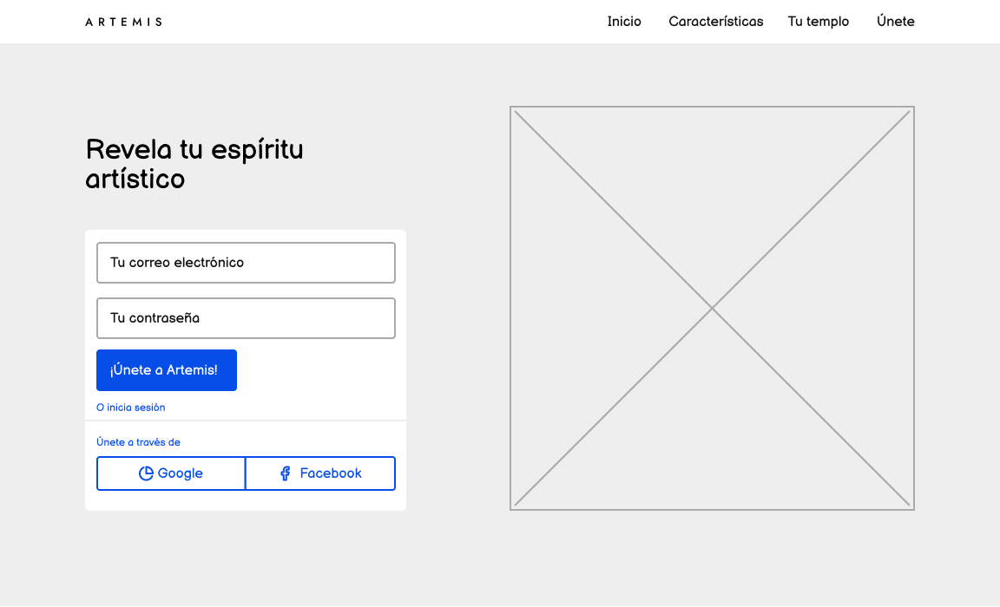

## Inicio de sesión

### Registrarse

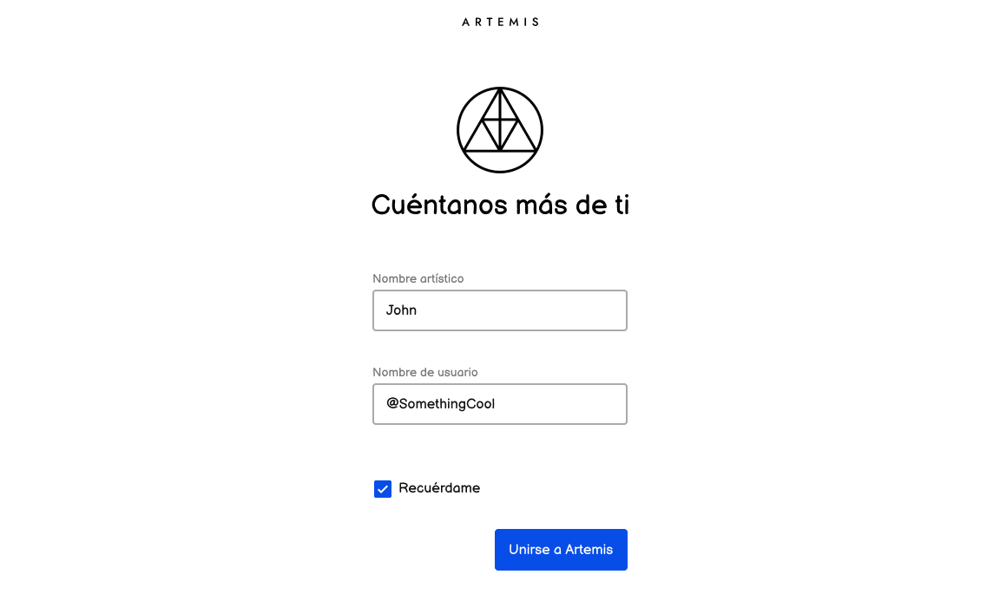

### Inicio de sesión

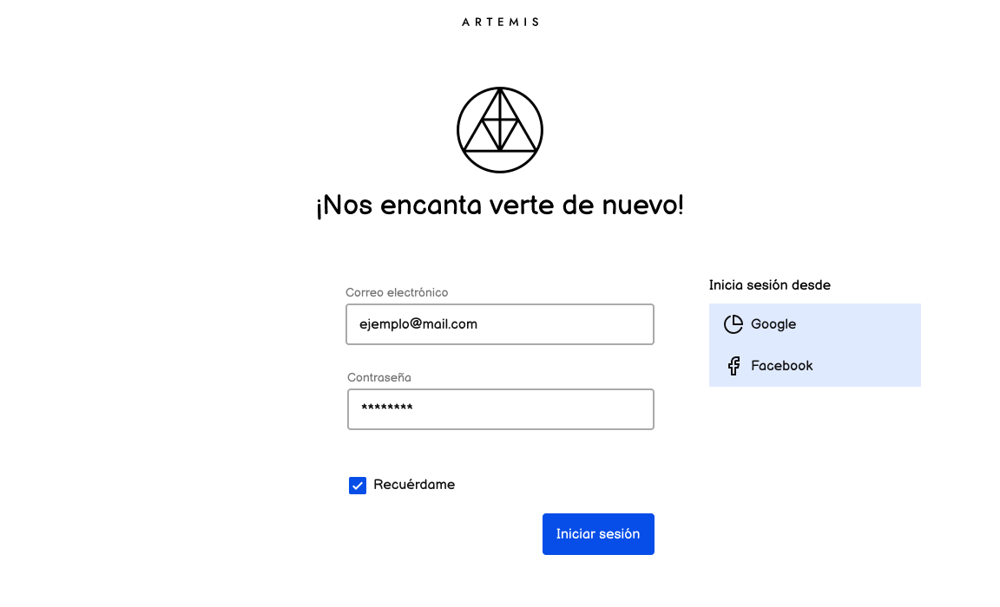

## Home

## Obras

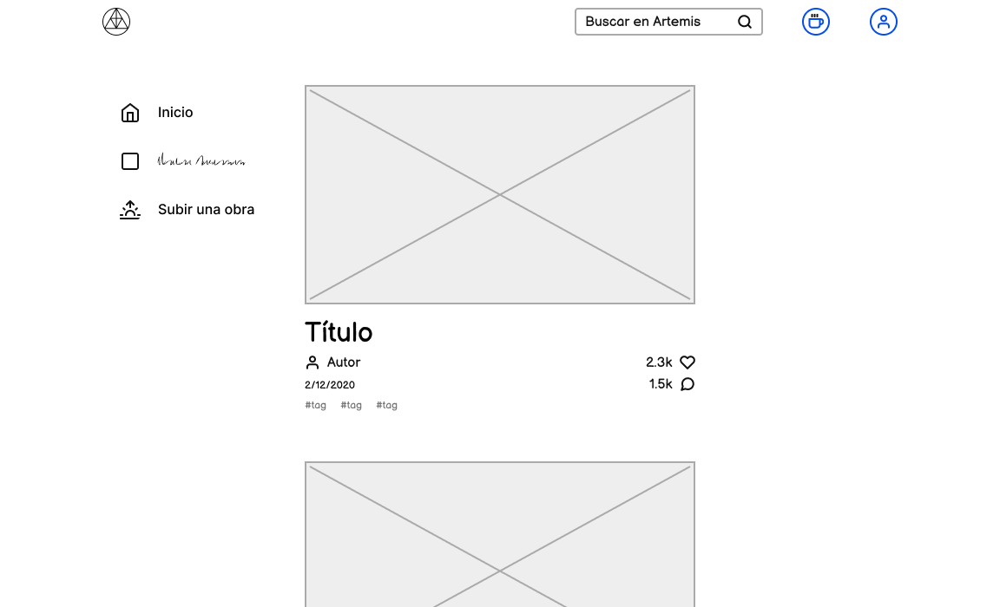

### Obra propia

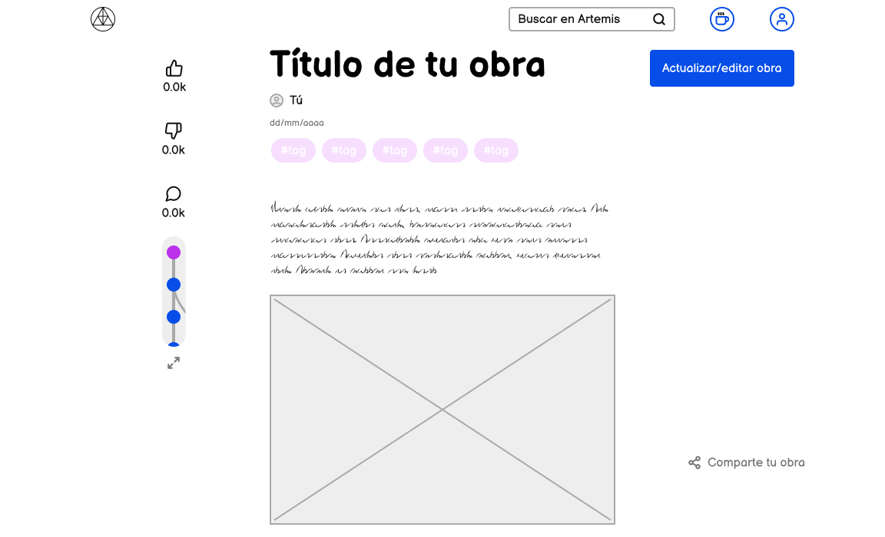

### Obra de tercero

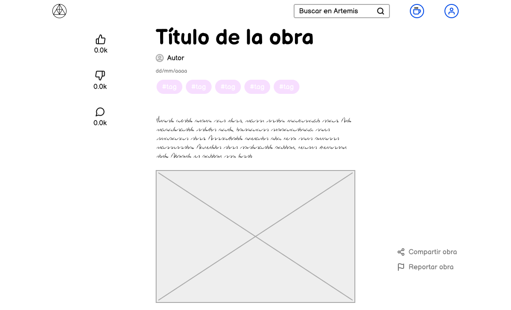

### Modificar obra propia

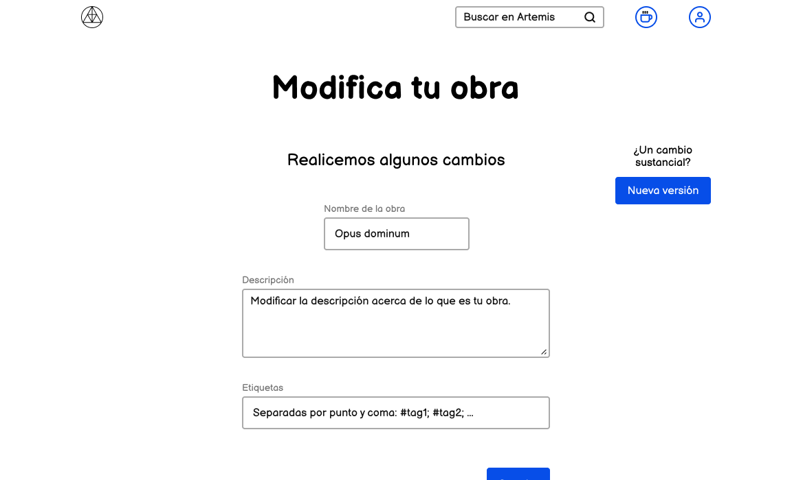

## Subir obra

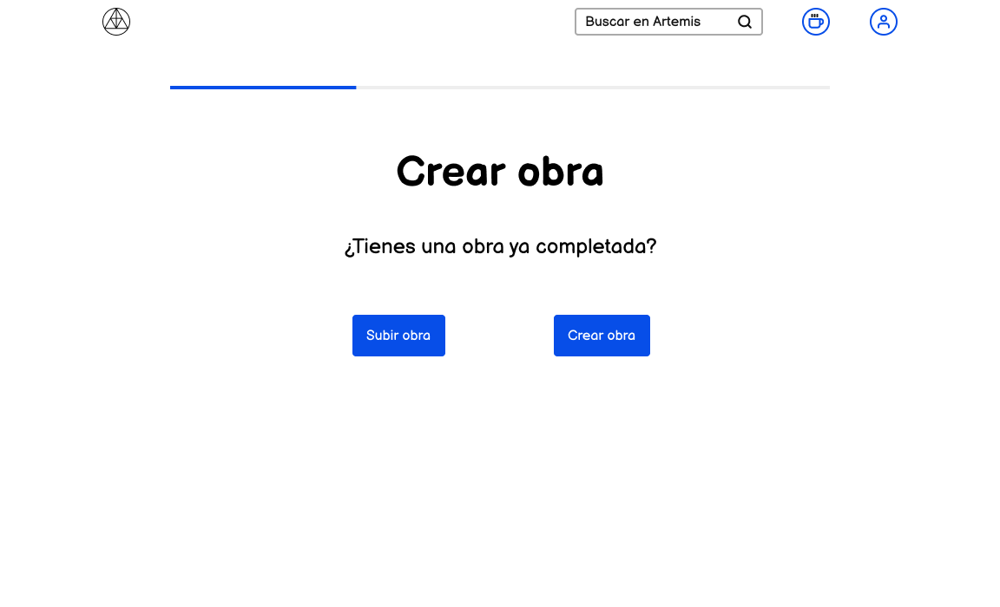

### Subir archivo

### Detalles finales

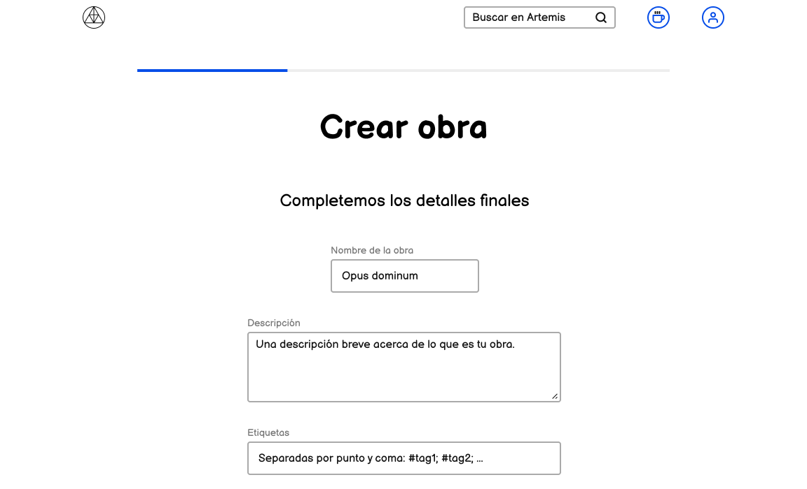

## Obras propias

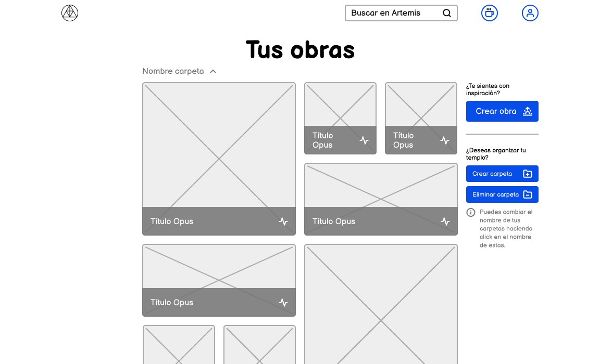

## Perfil

### Perfil propio

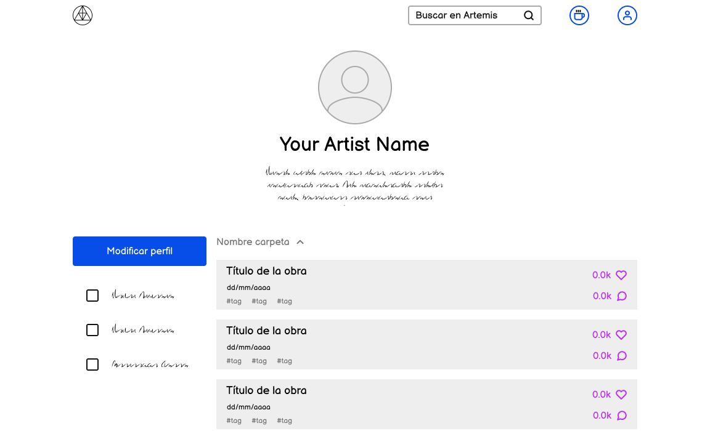

### Perfil de tercero

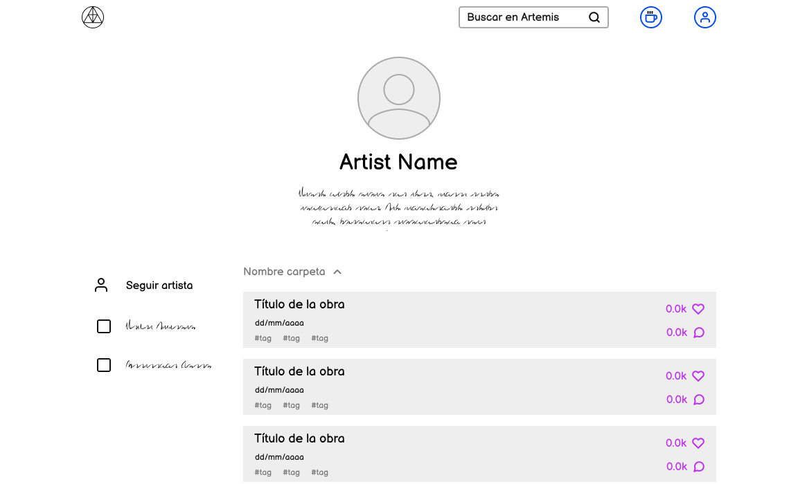

### Modificar perfil

---

## Información técnica

### Detalles
Fecha | Versión | Descripción | Autor
--|--|--|--
8 de diciembre de 2020 | 1.0.0 | Muestra inicial de los wireframes | UX/UI
8 de diciembre de 2020 | 1.1.0 | Correciones pertinentes | UX/UI

### Otros documentos
Previos a este | Siguientes a este
-- | --
Documento de Negocio | Diseño de mockups de UI